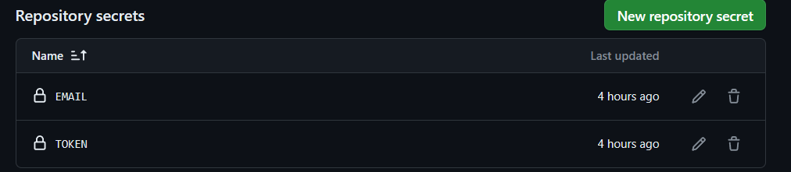

# Screeps Game scaffold & Archive

### Introduction
**This is my personal Screeps game archive repository. 
Among them, I configured screeps' support for typescript, support for es6+ syntax, 
grunt automatically pushes to the screeps server, grunt automatically flattens the file structure to adapt the file import path, 
github action automatically pushes to the screeps server during push, and multi-branch support. ....

I really like the environment of this Screeps game, even though it looks more like doing a job.
This allows people who play the game to focus more on writing better screeps script code instead of worrying about cumbersome tool chains.**

I'm glad you can use this Screeps code as a starting point for your Screeps game.

### How to adapt this scaffold & Archive to yourself

#### 1. You need to know that this set of code has been configured with a github action. When you push the code, it will automatically execute the github action. After the build, the code will be pushed to the screeps server.
#### 2. If you want to push this code to the screeps server to which your own screeps account belongs, you only need to set the following secrets in your own github repository
> EMAIL = xxxxxx
> 
> TOKEN = xxxxxx

#### 3. After the configuration is completed, all changes you make in this code will be pushed to your screeps account. Please note that it will not automatically create a new game.You still need to manually start an initial Spawn to start a new game. game.
*You also need to note that this code supports pushing multiple branches to the screeps server. When you switch to a new branch to push code, it will automatically trigger the github action process and synchronize your branch code changes to the screeps server. At the same time, please note that it will not automatically create a branch for you, so before the new branch is pushed, please make sure that this branch already exists in your screeps account.*
